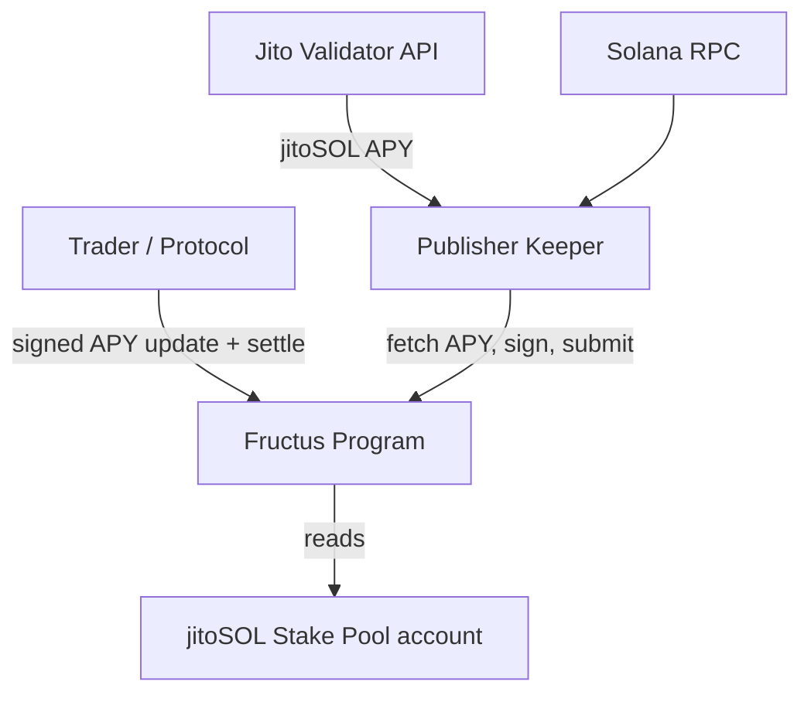
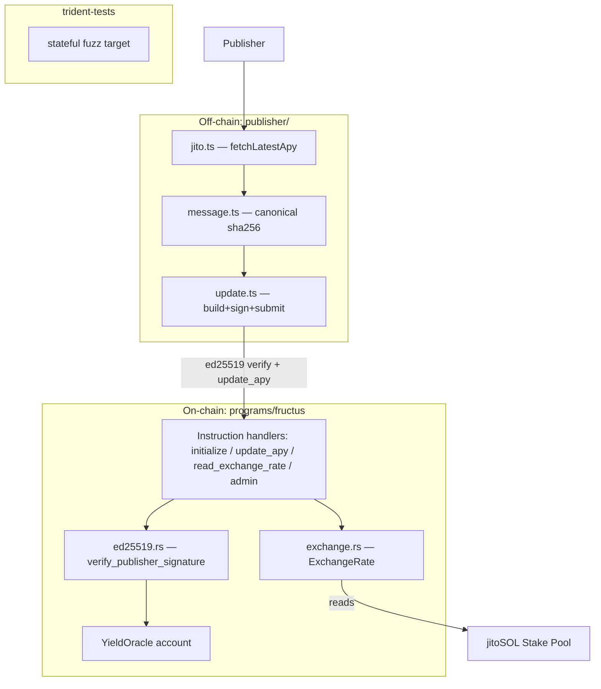

# Architecture

Fructus is a Solana yield-futures protocol. The current codebase implements the
**data module**: a mark-price APY oracle and a trustless settlement reference for
jitoSOL yield.

## System Context (C4 Level 1)

## Container Diagram (C4 Level 2)

## Data Flow

### Mark-price APY update (pull + fallback)

1. A trader's transaction carries the signed APY (pull), or the keeper submits it
   (fallback).
2. `update_apy` verifies the ed25519 signature against the stored publisher and
   the canonical message, enforces version monotonicity and APY bounds, then
   stores `apy` + `version` + `last_update_slot`.

### Settlement (trustless)

1. `read_exchange_rate` validates the pool account owner + `account_type` and
   reads `total_lamports` / `pool_token_supply`.
2. `ExchangeRate::realized_yield` derives `(rate_t1 / rate_t0 − 1) · SCALE`
   between two snapshots.

## Architectural Decisions

| Decision | Rationale | Status |
| --- | --- | --- |
| Mark price (oracle) and settlement (exchange rate) are separate sources | Settlement must be trustless/unmanipulable; mark price only needs freshness | Active |
| Pull oracle with permissionless signed updates | Saves chain writes when idle; anyone may relay signed data | Active |
| ed25519 signature via instruction introspection, byte-level comparison | Anchor 1.x "Address" migration makes `Pubkey`/`Address` types version-fragile; bytes are stable | Active |
| Trustless settlement reads the SPL Stake Pool account directly | Exchange rate is on-chain state → cannot stale or be manipulated | Active |
| `u128` intermediates in yield math | Avoid overflow on `u64` numerator/denominator products | Active |
| Cross-language message vector test | Locks publisher ↔ program signature consistency | Active |
