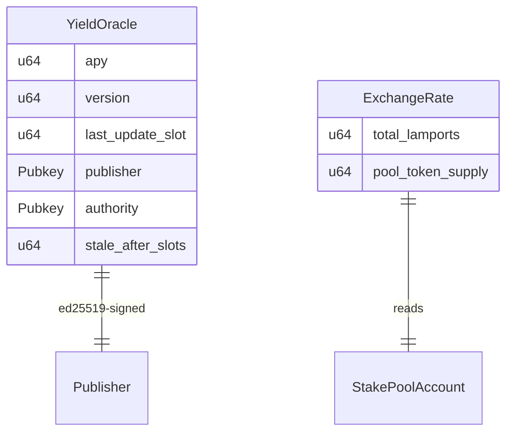

# Data Models

Two on-chain data shapes: the oracle account and the derived exchange rate.

## `YieldOracle` (anchor account)

Singleton PDA, seed `"yield_oracle"`. Borsh layout (after the 8-byte discriminator):

| Field | Type | Offset (payload) | Notes |
| --- | --- | --- | --- |
| `apy` | u64 | 0 | scaled by `1_000_000` |
| `version` | u64 | 8 | monotonic |
| `last_update_slot` | u64 | 16 | |
| `publisher` | Pubkey | 24 | authorized signer |
| `authority` | Pubkey | 56 | admin |
| `stale_after_slots` | u64 | 88 | staleness window |
| `bump` | u8 | 96 | PDA bump |

## `ExchangeRate` (derived, not stored)

| Field | Type | Source |
| --- | --- | --- |
| `total_lamports` | u64 | stake-pool account offset 258 |
| `pool_token_supply` | u64 | stake-pool account offset 266 |

- Rate = `total_lamports / pool_token_supply` (SOL per jitoSOL), kept as a
  rational pair to defer division until the yield computation.
- `realized_yield(t0, t1) = (rate_t1 / rate_t0 − 1) · 1_000_000`, computed with
  `u128` intermediates.

## Relationships

No database / migrations — state lives entirely in Solana accounts.
