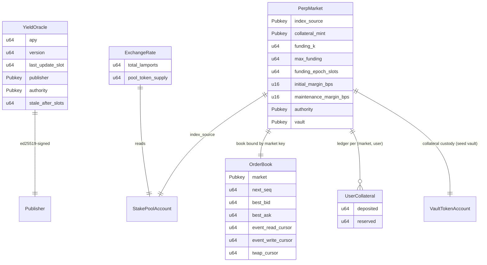

# Data Models

On-chain data shapes: the oracle account, the perpetual-market account, the
order book (with its inline `Order`/`OutEvent`/`Observation` sub-structs), the
collateral ledger, and the derived exchange rate.

## `YieldOracle` (anchor account)

Singleton PDA, seed `"yield_oracle"`. Borsh layout (after the 8-byte discriminator):

| Field | Type | Offset (payload) | Notes |
| --- | --- | --- | --- |
| `apy` | u64 | 0 | scaled by `1_000_000` |
| `version` | u64 | 8 | monotonic |
| `last_update_slot` | u64 | 16 | |
| `publisher` | Pubkey | 24 | authorized signer |
| `authority` | Pubkey | 56 | admin |
| `stale_after_slots` | u64 | 88 | staleness window |
| `bump` | u8 | 96 | PDA bump |

## `PerpMarket` (anchor account)

Singleton PDA, seed `"perp_market"`. Borsh layout (after the 8-byte discriminator):

| Field | Type | Offset (payload) | Notes |
| --- | --- | --- | --- |
| `index_source` | Pubkey | 0 | jitoSOL SPL Stake Pool account (validated at init) |
| `collateral_mint` | Pubkey | 32 | USDC mint (stored as-is, no on-chain check) |
| `funding_k` | u64 | 64 | convergence speed; fixed-point scale `1_000_000` |
| `max_funding` | u64 | 72 | per-epoch funding-rate cap; fixed-point scale `1_000_000` |
| `funding_epoch_slots` | u64 | 80 | epoch length in slots |
| `initial_margin_bps` | u16 | 88 | initial margin, basis points |
| `maintenance_margin_bps` | u16 | 90 | maintenance margin, basis points |
| `authority` | Pubkey | 92 | admin |
| `vault` | Pubkey | 124 | collateral-custody PDA (derived, not created at init) |
| `bump` | u8 | 156 | PDA bump |

- `LEN = 157` (packed borsh payload, excluding the 8-byte discriminator).
- Singleton seed `"perp_market"`; `index_source` and `collateral_mint` are plain
  fields, not seed components.
- `funding_k` / `max_funding` use the fixed-point scale `1_000_000`
  (`1.0 == 1_000_000`); the two margin fields use basis points (≤ `10_000`).

## `OrderBook` (zero-copy account)

One PDA per market, seed `[b"order_book", market.key()]`. Zero-copy (`#[repr(C)]`)
layout (after the 8-byte discriminator); fields are reordered and explicitly
padded so `bytemuck::Pod` has no implicit padding:

| Field | Type | Offset (payload) | Notes |
| --- | --- | --- | --- |
| `next_seq` | u64 | 0 | monotonic order id |
| `best_bid` | u64 | 8 | highest resting bid; `0` = side empty |
| `best_ask` | u64 | 16 | lowest resting ask; `0` = side empty |
| `event_read_cursor` | u64 | 24 | next event to drain |
| `event_write_cursor` | u64 | 32 | next event slot to write |
| `twap_cursor` | u64 | 40 | next TWAP observation slot |
| `market` | Pubkey | 48 | bound market (also in the PDA seed) |
| `bump` | u8 | 80 | PDA bump |
| `_pad` | `[u8; 7]` | 81 | explicit padding (8-align) |
| `bids` | `[Order; 64]` | 88 | resting bids; 64 bytes each |
| `asks` | `[Order; 64]` | 4184 | resting asks; 64 bytes each |
| `events` | `[OutEvent; 128]` | 8280 | event-queue ring; 96 bytes each |
| `observations` | `[Observation; 16]` | 20568 | TWAP ring; 32 bytes each |

- `LEN = 21_080` (`size_of::<OrderBook>()`, excluding the 8-byte discriminator).
- Fixed capacities: `MAX_ORDERS_PER_SIDE = 64`, `EVENT_QUEUE_LEN = 128`,
  `TWAP_OBSERVATIONS = 16`. The book's side is implied by which array an `Order`
  sits in (`bids` vs `asks`), so no side byte is stored.
- Zero-copy is required because the account exceeds the SBF 4 KiB stack limit for
  borsh deserialization; handlers access it via `AccountLoader::load_mut()`.

### `Order` (sub-struct)

| Field | Type | Offset (payload) | Notes |
| --- | --- | --- | --- |
| `owner` | Pubkey | 0 | signer who placed the order |
| `price` | u64 | 32 | `APY_SCALE` fixed point; `0` invalid |
| `size` | u64 | 40 | remaining (unfilled) size, notional USDC microunits |
| `seq` | u64 | 48 | monotonic order id (time priority) |
| `active` | u8 | 56 | `0` = empty slot |
| `_pad` | `[u8; 7]` | 57 | explicit padding (8-align) |

- `LEN = 64`. `active` is `u8` (not `bool`) because `bytemuck::Pod` forbids `bool`.

### `OutEvent` (sub-struct)

| Field | Type | Offset (payload) | Notes |
| --- | --- | --- | --- |
| `seq` | u64 | 0 | monotonic event id |
| `price` | u64 | 8 | traded price (fill) or order price |
| `size` | u64 | 16 | traded size (fill) or remaining size |
| `owner` | Pubkey | 24 | order owner |
| `counterparty` | Pubkey | 56 | matched counterparty (zero when unset) |
| `kind` | u8 | 88 | `0` = Fill, `1` = Cancel, `2` = Residual |
| `side` | u8 | 89 | `0` = Bid, `1` = Ask |
| `_pad` | `[u8; 6]` | 90 | explicit padding (8-align) |

- `LEN = 96`.

### `Observation` (sub-struct)

| Field | Type | Offset (payload) | Notes |
| --- | --- | --- | --- |
| `slot` | u64 | 0 | slot at which the sample was recorded |
| `mid` | u64 | 8 | mid price in effect at this sample (`0` = one-sided/undefined) |
| `cumulative_mid` | `[u8; 16]` | 16 | running `Σ mid × Δslot` (LE `u128`) |

- `LEN = 32`. `cumulative_mid` is stored as 16 raw bytes (not `u128`) for
  cross-target alignment stability in the zero-copy layout.

## `UserCollateral` (anchor account)

One PDA per `(market, user)`, seed `[b"user_collateral", market.key(),
user.key()]`. Borsh layout (after the 8-byte discriminator):

| Field | Type | Offset (payload) | Notes |
| --- | --- | --- | --- |
| `deposited` | u64 | 0 | USDC credited to the user, microunits |
| `reserved` | u64 | 8 | USDC reserved for open positions (stubbed `0`) |
| `bump` | u8 | 16 | PDA bump |

- `LEN = 17`.
- Lazily initialized on first deposit; `reserved` has no writer this iteration.

## `ExchangeRate` (derived, not stored)

| Field | Type | Source |
| --- | --- | --- |
| `total_lamports` | u64 | stake-pool account offset 258 |
| `pool_token_supply` | u64 | stake-pool account offset 266 |

- Rate = `total_lamports / pool_token_supply` (SOL per jitoSOL), kept as a
  rational pair to defer division until the yield computation.
- `realized_yield(t0, t1) = (rate_t1 / rate_t0 − 1) · 1_000_000`, computed with
  `u128` intermediates.

## Relationships

No database / migrations — state lives entirely in Solana accounts.
