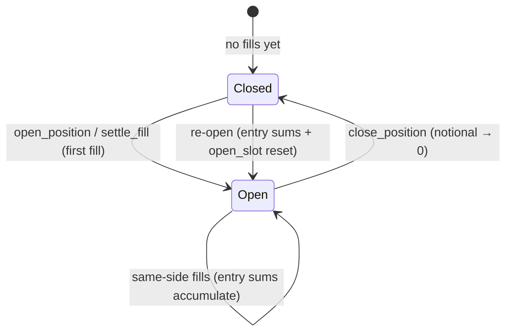
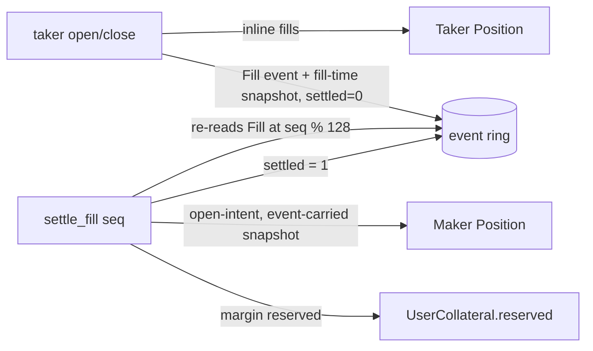

# Module: Position Lifecycle (open/close long & short)

**Purpose:** The trading engine of Fructus — a per-`(market, user, side)`
`Position` account opened and closed through the #3 CLOB (`open_position` /
`close_position`), plus a permissionless `settle_fill` that books resting
makers' fills from the event queue. The lifecycle is **order-driven**: orders
are the only way positions change, and positions result from matched fills.
Margin is **ledger-only** — `Position.collateral` is reserved inside
`UserCollateral.reserved`, so the #4 `free_collateral` seam gates every open
and every withdrawal — and PnL is a pure signed function (realizing it into
collateral is issue #7). All arithmetic is `u64`/`u128`/`i128` +
`checked_*`/`saturating_*`; the property-testable logic lives in the pure
`crate::positions` module (mirroring `orderbook.rs` / `collateral.rs`).

## Public API

| Instruction | Signature | Description |
| --- | --- | --- |
| `open_position` | `(side: u8, size: u64, price: u64)` | Open (or add to) a position: place a limit order (`price != 0`, rests if non-crossing) or market-IOC order (`price == 0`); taker fills settle inline |
| `close_position` | `(side: u8, size: u64)` | Reduce/close the named side with a market-IOC order on the **opposite** side; lifecycle-only (no PnL settlement) |
| `settle_fill` | `(seq: u64)` | Permissionless: book one resting maker's `Fill` from the event queue (open-intent, idempotent) |

| Pure function | Signature | Description |
| --- | --- | --- |
| `margin_required` | `(notional: u64, initial_margin_bps: u16) -> Option<u64>` | `(notional × bps + 9_999) / 10_000` — **ceiling** division, `u128` intermediates; `None` only on overflow (total on its domain) |
| `accumulate_entry` | `(cur_n_sum: u128, cur_d_sum: u128, add_n: u64, add_d: u64, add_w: u64) -> Option<(u128, u128)>` | Accumulate the entry running sums: `cur_n_sum += add_n × add_w`, `cur_d_sum += add_d × add_w` (checked) |
| `normalize_sums` | `(entry_n_sum: u128, entry_d_sum: u128) -> (u64, u64)` | Shared power-of-two shift (`k = max(0, bitlen(max) − 45)`); the larger sum lands in `[2^44, 2^45)` |
| `signed_yield_change` | `(entry_n_sum: u128, entry_d_sum: u128, cur_n: u64, cur_d: u64) -> Option<i128>` | `(rate_cur / rate_entry − 1) × APY_SCALE` **with sign**, cross-multiplied; `None` on degenerate inputs |
| `pnl` | `(entry_n_sum, entry_d_sum, cur_n, cur_d, notional: u64, side) -> Option<i128>` | `notional × signed_yield_change / APY_SCALE × (+1 Long, −1 Short)`, signed USDC microunits, truncating toward zero |
| `validate_open_args` | `(side: u8, size: u64) -> Result<()>` | `side` must be `0`/`1` (`ProgramError::InvalidInstructionData` otherwise — the existing `side_from_u8` behavior, no `InvalidSide` variant), `size > 0` (`InvalidSize`) |

## The `Position` account

One PDA per `(market, user, side)`, seed
`[POSITION_SEED, market.key(), user.key(), side]` with
`POSITION_SEED = b"position"`. The `side` byte reuses the book-side encoding —
`0` = Long/Bid, `1` = Short/Ask — so a user may hold long **and** short
simultaneously and `close_position(side)` names its target. Payload (borsh,
after the 8-byte discriminator): `market` (32) · `owner` (32) · `side` (1) ·
`notional` (8) · `entry_n_sum` (16) · `entry_d_sum` (16) · `collateral` (8) ·
`last_funding_epoch` (8) · `open_slot` (8) · `bump` (1), `LEN = 130`. Full
field-level offsets in [data-models.md](../data-models.md).

- Lazily created on first fill/settlement (payer = the user for inline taker
  fills, the settler for `settle_fill`) and **retained** after a full close;
  `notional == 0` means closed.
- A re-open (from `notional == 0`) **resets** `entry_n_sum` / `entry_d_sum` /
  `open_slot` — the new fill becomes the fresh entry. Same-side adds on a live
  position accumulate the entry sums.
- The account is a plain borsh `#[account]` (well under the 4 KiB zero-copy
  threshold), so it declares native `u128` fields — no per-access byte
  conversion.
- Compare pubkeys at byte level (`as_ref()`/`to_bytes()`), per AGENTS.md.

## Lifecycle



1. **Open** — `open_position(side, size, price)`: validate args; read the index
   snapshot from the market-bound `index_source`; load the book; place a limit
   order (`price != 0`, rests if non-crossing) or market-IOC order (`price ==
   0`). Taker fills settle **inline** (the taker's accounts are always in the
   tx): lazy-create the `Position`, `notional += size`, entry sums accumulated,
   margin reserved against free collateral. Every `Fill` event is stamped with
   the in-tx snapshot and `settled = 0` for the maker's later settlement.
2. **Close** — `close_position(side, size)`: require `size > 0`
   (`InvalidSize`), `notional > 0` (`PositionNotFound`), and `size <= notional`
   (`InvalidCloseSize`); place a **market-IOC order on the opposite side**.
   Taker fills reduce the position (`notional -= size`, entry unchanged, margin
   released). No PnL settlement (issue #7 owns realizing PnL).
3. **Maker settlement** — `settle_fill(seq)`: locate `slot = seq %
   EVENT_QUEUE_LEN`; if the slot holds a `Fill` with `event.seq == seq` and
   `settled != 0`, return `Ok` (idempotent no-op); otherwise require
   `event.seq == seq`, `kind == Fill`, `settled == 0`; derive the maker's
   `Position` PDA from `event.owner` + `event.side` and verify the supplied
   accounts (a mismatch fails with `ProgramError::InvalidAccountData`); apply
   **open-intent** (below); mark `settled = 1`.
4. **Crank & book-only orders** — `place_limit_order` / `place_market_order` /
   `crank` gain the market-bound `index_source` (readonly) purely to **stamp**
   fills; they never touch a taker's position. Residuals originate only from
   position-neutral `place_limit_order` (D10′), so the crank takes **no
   position accounts** and never settles positions.

### Open-intent maker settlement (D5)

A resting order is unambiguous — a resting bid ⇒ open long, a resting ask ⇒
open short — so the `Fill` event needs **no intent tag**. `settle_fill`
therefore applies open semantics to the maker's position:

- maker's position closed (`notional == 0`) ⇒ **re-open**: `entry_* :=` the
  **event-carried** fill-time snapshot weighted by `event.size`,
  `open_slot :=` the current slot;
- otherwise `notional += size` and the entry sums **accumulate the
  event-carried** snapshot (not the settlement-time rate — D7);
- margin reserved against the maker's free collateral;
- mark `settled = 1`.

Retryable on margin shortfall: the atomic revert leaves the event un-settled.
Resting closes are deferred to a later iteration (they would need an intent
tag), so only open-intent orders rest.

## Margin math (D11)

Reserved collateral is **ledger-only** — no token movement on open or close:

```
margin_required(notional, im_bps) = (notional × im_bps + 9_999) / 10_000   (ceiling, u128)
Position.collateral              = margin_required(notional, market.initial_margin_bps)
UserCollateral.reserved          = Σ Position.collateral  over (long, short)
free                             = deposited − reserved   (the #4 seam — never negative)
```

The ceiling division keeps `collateral ≥ 1` for every `notional ≥ 1`,
`bps ≥ 1`, and implied leverage `notional / collateral ∈ [1, 10_000 / bps]`
exactly — margin is never below the exact requirement. Pinned properties:
monotonic in `notional`; `margin_required(0, _) == 0`; `margin_required(n,
10_000) == n` (exact 1×). Every open (`open_position`, `settle_fill`) and every
withdrawal checks the same `free_collateral` predicate, so a margin shortfall
fails the whole transaction atomically — including a missing `UserCollateral`
ledger, which reports `InsufficientFreeCollateral` (the ledger is
deposit-created, so a missing ledger is a free-collateral error, not an
account-format error).

## Entry index & PnL (D6/D12)

The entry index is stored as **notional-weighted running sums** (`entry_n_sum`
/ `entry_d_sum`, `u128`) — exact average-cost accounting with no intermediate
rounding; the entry rate lies strictly between the component fill rates
(weights `fill_size × d_component`). The snapshot rate is
`entry_n_sum / entry_d_sum`, computed at PnL time after a shared power-of-two
normalization (`normalize_sums`: `k = max(0, bitlen(max) − 45)`, the larger sum
lands in `[2^44, 2^45)`), because the raw sums are O(pool size × cumulative
notional) and their direct cross-products overflow `u128` for production LST
pools. The ratio's relative error is bounded by `2^-44 × (1 + max/min)` — at
most ~`2^-34` in the production rate band `[1, 1e3]`, far below `APY_SCALE`'s
1e-6 granularity.

PnL is a **pure signed** function (USDC microunits, `i128`):

```
signed_yield_change = ((cur_n × d_e) − (n_e × cur_d)) × APY_SCALE / (n_e × cur_d)   (sign from the numerator)
pnl = notional × signed_yield_change / APY_SCALE × side                              (+1 Long, −1 Short)
```

Truncation toward zero gives the quantization floor: `pnl == 0` whenever
`notional × |signed_yield_change| < APY_SCALE`. Realizing PnL into
`UserCollateral` is issue #7 — this iteration only computes it (with sign
tests: `pnl(Long) > 0 ⟺ rate_cur > rate_entry`, `pnl(Short)` the exact
opposite).

## Settlement flow



- **Taker-inline**: a taker's fills settle in the taker's own `open_position` /
  `close_position` transaction — the taker's `Position`/`UserCollateral`
  accounts are always in the tx.
- **Maker-deferred**: a resting maker's identity is unknown at tx-build time, so
  `settle_fill` re-reads the `Fill` event and the caller supplies the maker's
  accounts, verified by PDA derivation against `event.owner` + `event.side`.
- **Snapshot discipline**: every fill-producing instruction (the five —
  `open_position`, `close_position`, `place_limit_order`, `place_market_order`,
  `crank`) validates that `index_source` **byte-equals** `market.index_source`
  (plus stake-pool owner/discriminator validation) and reads the snapshot once
  per tx (same slot ⇒ same rate), stamping it verbatim onto every `Fill` it
  emits. `settle_fill` itself is not fill-producing and takes no `index_source`.
- **Idempotency**: `settled` flips to `1` on consumption; a second
  `settle_fill` on the same `seq` is a no-op.

## Liveness bound (OQ-1)

An executed fill **always persists its event**: a full event ring fails the
fill-producing transaction with `BookFull` (D10) — fills are never silently
dropped, so a maker can always in principle settle. But an un-settled `Fill` is
settle-able only while its ring slot survives: the 128-entry ring holds the 128
**newest** events, so a maker has at most 128 newer events before its `Fill` is
overwritten and `settle_fill` fails `EventNotFound`. Accepted MVP bound — the
per-position settlement ledger is the over-engineering alternative. In
practice: `settle_fill` promptly (or crank first to drain), and retry on
`EventNotFound` is not possible once overwritten.

## Dependencies

- Inbound: `lib.rs` (`open_position`, `close_position`, `settle_fill`;
  `place_*`/`crank` only consume the `index_source` stamping).
- Outbound: `positions` (pure margin/entry/PnL logic), `constants`
  (`POSITION_SEED`, `EVENT_QUEUE_LEN`, `APY_SCALE`, `MAX_MATCH_STEPS`), `error`
  (`PositionNotFound`, `EventNotFound`, `InvalidCloseSize`, reused
  `InvalidSize`/`InsufficientFreeCollateral`/`BookFull`), `state` (`Position`,
  `UserCollateral`, `PerpMarket`, `OrderBook`, `OutEvent`), `orderbook`
  (matching engine), `collateral` (`free_collateral`), `exchange`
  (`ExchangeRate::read` via the stake-pool validation in `lib.rs`).

## Patterns & Gotchas

- **Pure logic, thin adapter** — `positions.rs` works on plain
  `u64`/`u128`/`i128` values so `proptest` drives the invariants directly;
  `lib.rs` applies them to the on-chain `Position`/`UserCollateral` accounts.
- **Order-driven** — positions only change through matched fills; there is no
  direct position mutation instruction.
- **Close is lifecycle-only** — it reduces `notional` and releases margin but
  never realizes PnL; #7 owns settlement.
- **Entry sums reset on re-open** — from `notional == 0`, the new fill's
  snapshot replaces the sums, and `open_slot` is reset to the settlement slot
  (maker re-opens) or the fill slot (inline taker opens).
- **`price == 0` is the market signal** for `open_position`, so it has no
  `InvalidPrice` path (unlike `place_limit_order`).
- **Fill events carry the fill-time snapshot, not the settlement-time rate** —
  stamping happens once per tx at the taker's/cranker's index source, and
  `settle_fill` re-reads the event rather than re-reading the pool.
- **Byte-level pubkey compare** per AGENTS.md — no type-identity dependence in
  the PDA-verification checks.
